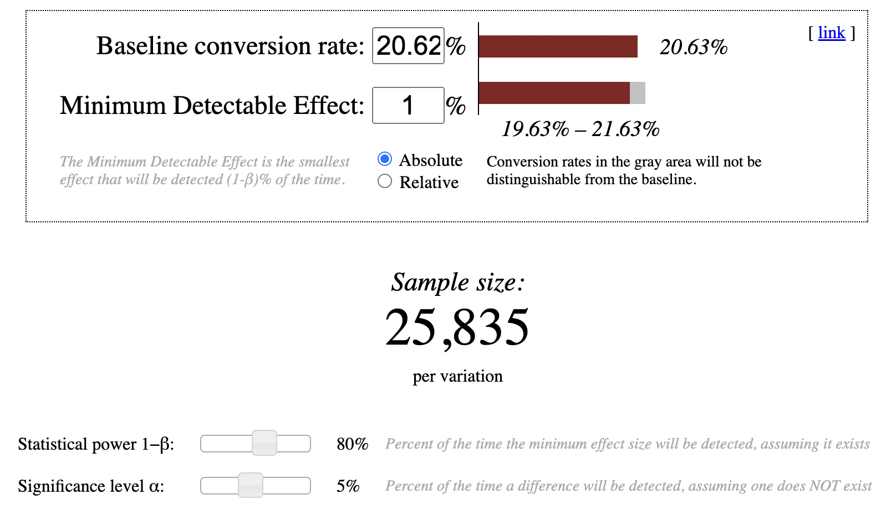
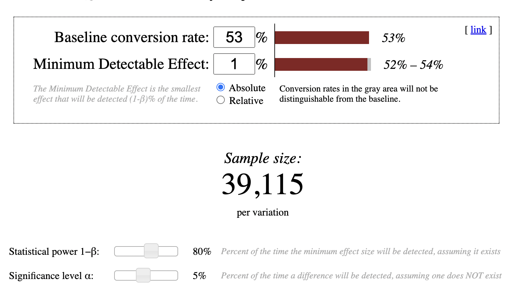
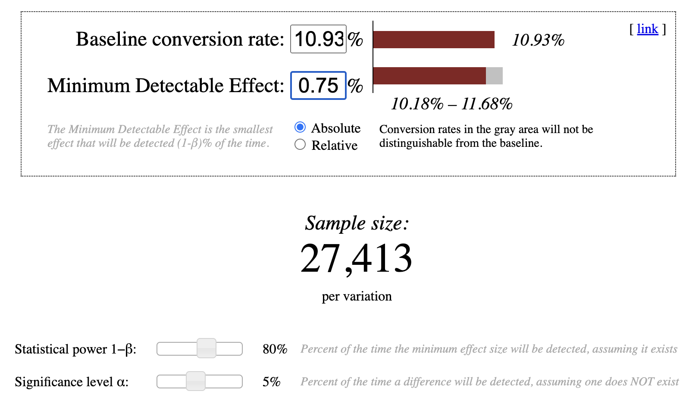

# Ab-Testing-Udacity

## 1. Current State

At the time of this experiment, Udacity courses currently have two options on the course overview page: "start free trial", and "access course materials". 

If the student clicks "start free trial", they will be asked to enter their credit card information, and then they will be enrolled in a free trial for the paid version of the course. After 14 days, they will automatically be charged unless they cancel first.

If the student clicks "access course materials", they will be able to view the videos and take the quizzes for free, but they will not receive coaching support or a verified certificate, and they will not submit their final project for feedback.

## 2. Experiment Proposed

Udacity tested a change where if the student clicked "start free trial", they were asked how much time they had available to devote to the course. 

If the student indicated 5 or more hours per week, they would be taken through the checkout process as usual. If they indicated fewer than 5 hours per week, a message would appear indicating that Udacity courses usually require a greater time commitment for successful completion, and suggesting that the student might like to access the course materials for free. At this point, the student would have the option to continue enrolling in the free trial, or access the course materials for free instead.

## 3. Experiment Goal

The hypothesis was that this might set clearer expectations for students upfront, thus reducing the number of frustrated students who left the free trial because they didn't have enough time—without significantly reducing the number of students to continue past the free trial and eventually complete the course. If this hypothesis held true, Udacity could improve the overall student experience and improve coaches' capacity to support students who are likely to complete the course.

## 4. Experiment Design

### 4.1 Hypothesis Definition
Null hypothesis: Setting clear expectations before enrolling will not reduce the number of furstrated students 

Alternate hypothesis: Setting clear expectations before enrolling will reduce the number of furstrated students, thereby improving student experience

Formulating in mathematical terms:

   - H0: the change has no effect on the number of students who enroll the free trial.  
 
     HA: the change has effect on the number of students who enroll the free trial.
     
  - H0: the change has no effect on the number of students who pay after the 14 day trial.
 
    HA: the change has effect on the number of students who pay after the 14 day trial.
     
  - H0: the change has no effect on probability of students dropping during the free trial.
 
    HA: the change has an effect on probability of students dropping during the free trial
     
### 4.2 Metric Definition

These are the 7 metrics given by Udacity 

- **Number of cookies:** That is, number of unique cookies to view the course overview page. (dmin=3000)
- **Number of user-ids:** That is, number of users who enroll in the free trial. (dmin=50)
- **Number of clicks:** That is, number of unique cookies to click the "Start free trial" button (which happens before the free trial screener is trigger). (dmin=240)
- **Click-through-probability:** That is, number of unique cookies to click the "Start free trial" button divided by number of unique cookies to view the course overview page. (dmin=0.01)
- **Gross conversion:** That is, number of user-ids to complete checkout and enroll in the free trial divided by number of unique cookies to click the "Start free trial" button. (dmin= 0.01)
- **Retention:** That is, number of user-ids to remain enrolled past the 14-day boundary (and thus make at least one payment) divided by number of user-ids to complete checkout. (dmin=0.01)
- **Net conversion:** That is, number of user-ids to remain enrolled past the 14-day boundary (and thus make at least one payment) divided by the number of unique cookies to click the "Start free trial" button. (dmin= 0.0075)

**Unit of diversion:** The unit of diversion is a cookie, although if the student enrolls in the free trial, they are tracked by user-id from that point forward. The same user-id cannot enroll in the free trial twice. For users that do not enroll, their user-id is not tracked in the experiment, even if they were signed in when they visited the course overview page.

#### 4.2.1 Invariant Metrics

I'll be choosing the following metrics as my invariant metrics

- **Number of cookies:** The number of unique cookies in the treatment and control groups should be the same to make a comparison between the two groups
- **Number of clicks:** The number of clicks on the "Start Free Trial" buttons should be more or less the same for both the groups as the change is incorporated after the user clicks the button
- **Click through probability:** (# of unique cookies that click "Start Trial" buttton) / (# of unique cookies that view the course overview page) 

#### 4.2.2 Evaluation Metrics

- **Gross Conversion:** (# of user-ids that complete check-out) / (# of unique cookies that click "Start Trial" button). We expect this metric to be lower in our treatment group than the control group, since adding our change will make the user more aware about the amount of time the course demands
- **Retention:** (# of user-ids enrolled post 14-day trial) / (# of user-ids enrolled in the free trial). We expect this metric to be higher in the treatment group as the change will enforce only those students to enroll who have the time to devotr to the course. 
- **Net conversion:** (# of user-ids enrolled post 14-day trial) / (# of unique cookies that clicked "Start Trial" button. We expect this metric to be higher in the treatment group as with our change only users that have the dedicated time will be enrolled in the course. 

#### 4.2.3 Guardrail metrics

- **Number of user-ids** (# of users who enroll in the free trial). Irrespective of our change this metrics should not decrease below a particular threshold. If this metric decreases below a particular threshold, it shows that the changes is doing more harm than good and hence, the change should not be implemented and in some case the experiment should be stopped mid-way

#### 4.2.4 Updated Hypothesis

- H0: Gross conversion (Control) = Gross conversion (Treatment)

  HA: Gross conversion (Control) > Gross conversion (Treatment)
  
- H0: Retention (Control) = Retention (Treatment)

  HA: Retention (Control) < Retention (Treatment)
  
- H0: Net Conversion (Control) = Net Conversion (Treatment)

  HA: Net Conversion (Control) < Net Conversion (Treatment)

### 4.3 Measuring Variability

Here, we calculate the variability for each of our evaluation metric analytically. We use a sample size of 5000 cookies as given. Pleaser refer the notebook for calculations. 

| Metric | Standard Deviation |
| ---------- | :-----------:  | 
|Gross Conversion | 0.0202|
|Retention | 0.0549|
|Net conversion | 0.0156|

### 4.4 Sizing the experiment

#### 4.4.1 Gross Conversion

Given
- **Baseline conversion rate:** 0.2062
- **Minimum detectable effect:** 0.01
- **Alpha:** 0.05
- **Beta:** 0.2
- **Total number of user-ids to enroll in free-trial:** 3200
- **Total number of unique cookies to view course overview page:** 40000
- **Enrollments/page view:** 3200/40000: 0.08

I used this calculator to get the sample size

- **Total groups:** 2
- **Sample size:** 25,835
- **Total Sample Size:** 51,670 enrollments
- **Total unique page views:** 51670 / 0.08 = 645,875

#### 4.4.2 Retention

Given 

- **Baseline conversion rate:** 0.2062
- **Minimum detectable effect:** 0.01
- **Alpha:** 0.05
- **Beta:** 0.2
- **Number of user-ids enrolled past 14-day free trial:** 660
- **Number of user-ids that start free-trial:** 3200
- **user-ids enrolled past 14-day free trial/user-id that start free-trial:** 660/3200= 0.20625

I used this calculator to get the sample size

- **Total groups:** 2
- **Sample size:** 39,115
- **Total Sample Size:** 78,230 enrollments
- **Total user-ids that start free trial:** 78230 / 0.20625 = 379,297 
- **Total unique page views:** 379,297/ (3200/40000) = 4,741,213

#### 4.4.3 Net Conversion

Given 

- **Baseline conversion rate:** 0.1093
- **Minimum detectable effect:** 0.075
- **Alpha:** 0.05
- **Beta:** 0.2
- **Number of user-ids enrolled past 14-day free trial:** 660
- **Number of unique cookies that click "Start Free Trial":** 3200
- **Number of unique course-view pages:** 40,000

I used this calculator to get the sample size

- **Total groups:** 2
- **Sample size:** 27,413
- **Total Sample Size:** 54,826
- **Total unique page views:** 54826/ (3200/40000) = 685,325

